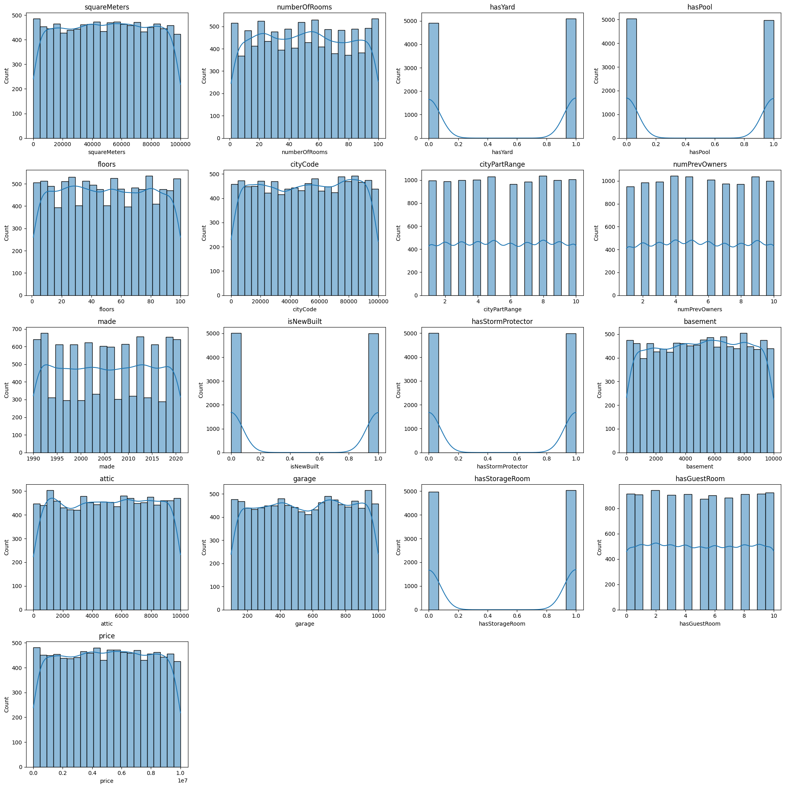
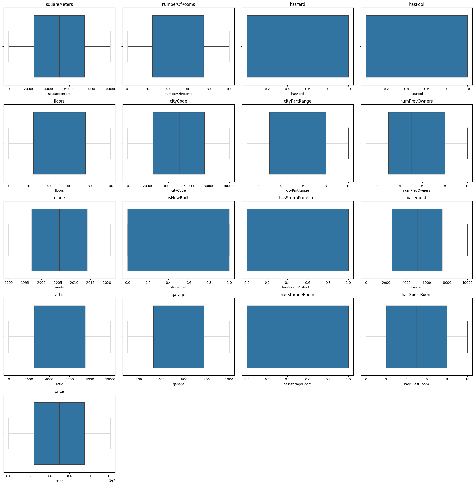
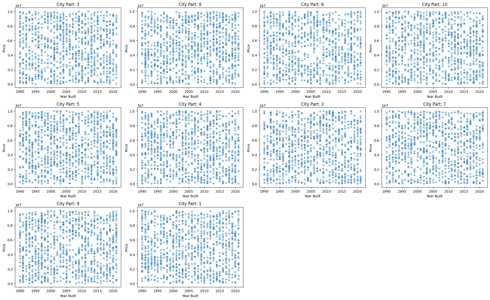
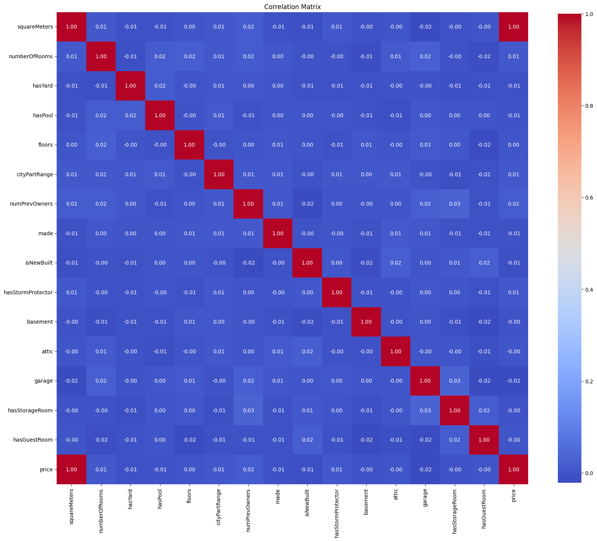

# Task 5D - Paris Housing Price Prediction using Regression

| Submission Summary |                         |
| ------------------ | ----------------------- |
| Student Name       | Bandi Krishna Chaitanya |
| Student ID         | s225170881              |
| Target Grade       | Distinction             |
| Submission Date    | 2 August 2025           |

## Table of Contents

## Introduction

The goal of this project is to predict housing prices in Paris using regression techniques. We will explore various features of the dataset, preprocess the data, try different regression models, and evaluate their performance. The final model will be deployed using a Streamlit application for user interaction.

The dataset used in this project is sourced from Kaggle, which contains various features related to housing in Paris, including location, size, and amenities. The target variable is the price of the houses. 

Link to the dataset: [https://www.kaggle.com/datasets/mssmartypants/paris-housing-price-prediction](https://www.kaggle.com/datasets/mssmartypants/paris-housing-price-prediction) 

## Dataset Description

The dataset consists of several features that describe the properties of houses in Paris, and the price of each house.

Below are the features included in the dataset:

| Feature           | Description                                                                          |
| ----------------- | ------------------------------------------------------------------------------------ |
| squareMeters      | Total area of the house in square meters                                             |
| numberOfRooms     | Total number of rooms in the house                                                   |
| hasYard           | Whether the property has a yard (1 or 0)                                             |
| hasPool           | Whether the property has a swimming pool (1 or 0)                                    |
| floors            | Number of floors in the house                                                        |
| cityCode          | Zip code of the property location                                                    |
| cityPartRange     | Exclusivity rating of the neighborhood (higher values indicate more exclusive areas) |
| numPrevOwners     | Number of previous owners of the property                                            |
| made              | Year the house was built                                                             |
| isNewBuilt        | Whether the property is newly constructed (1 or 0)                                   |
| hasStormProtector | Whether the property has storm protection (1 or 0)                                   |
| basement          | Size of the basement in square meters                                                |
| attic             | Size of the attic in square meters                                                   |
| garage            | Size of the garage                                                                   |
| hasStorageRoom    | Whether the property has a storage room (1 or 0)                                     |
| hasGuestRoom      | Number of guest rooms in the house                                                   |

And the target variable is `price`, which represents the price of the house in Euros. There is no indication in the original dataset that the prices are in Euros, but for the sake of this project, we will assume that they are, as the dataset is focused on Paris housing prices.

## Dataset Exploration

Let us start with exploring the dataset to understand its structure, check for missing values, and visualize the distribution of features and the target variable.

### Initial Inspection

There are a total of 10,000 entries in the dataset. The target variable `price` is continuous.

Here are the data types of each column in the dataset:

| Feature           | Data Type |
|-------------------|-----------|
| squareMeters      | int64     |
| numberOfRooms     | int64     |
| hasYard           | int64     |
| hasPool           | int64     |
| floors            | int64     |
| cityCode          | int64     |
| cityPartRange     | int64     |
| numPrevOwners     | int64     |
| made              | int64     |
| isNewBuilt        | int64     |
| hasStormProtector | int64     |
| basement          | int64     |
| attic             | int64     |
| garage            | int64     |
| hasStorageRoom    | int64     |
| hasGuestRoom      | int64     |
| price             | float64   |

    Table 1: Data Types of Features

As can be seen, all features are numerical, and the target variable `price` is a float.

Some of the features are binary (0 or 1), such as `hasYard`, `hasPool`, `isNewBuilt`, etc. Others are continuous, such as `squareMeters`, `basement`, `attic`, and `garage`.

While these binary features are discovered as integer types, they represent categorical data. We will treat them as such in our analysis.

### Check for Missing Values

Handling missing values is crucial for building a robust regression model. It appears that there are no missing values at all in this dataset.

| Feature           | Missing Values |
|-------------------|----------------|
| squareMeters      | 0              |
| numberOfRooms     | 0              |
| hasYard           | 0              |
| hasPool           | 0              |
| floors            | 0              |
| cityCode          | 0              |
| cityPartRange     | 0              |
| numPrevOwners     | 0              |
| made              | 0              |
| isNewBuilt        | 0              |
| hasStormProtector | 0              |
| basement          | 0              |
| attic             | 0              |
| garage            | 0              |
| hasStorageRoom    | 0              |
| hasGuestRoom      | 0              |
| price             | 0              |

    Table 2: Missing Values in Features

Since there are no missing values, we can proceed with the analysis without needing to impute or drop any rows.

### Univariate Analysis

Lets now visualize the distribution of each feature and the target variable `price`.

    
    
Figure 1: Univariate Analysis of Features and Target Variable

Lets first look at the nature of each feature, both based on their data types and the distribution of their values:

- Continuous features are
    - `squareMeters`
    - `numberOfRooms`
    - `floors`
- Boolean features are
    - `hasYard`
    - `hasPool`
    - `isNewBuilt`
    - `hasStormProtector`
    - `hasStorageRoom`
    - `hasGuestRoom`
- Categorical features are
    - `cityCode`
    - `cityPartRange`
    - `numPrevOwners`
    - `made`

And we can also make the following observations based on the univariate analysis:

- Target variable `price` appears to be slightly right-skewed, indicating that most houses are priced lower, with a few high-value outliers. We will need to further analyze if there are any outliers that could affect our regression model.
- The `made` feature, which represents the year the house was built, has a wide range of values, indicating that the dataset includes both old and new houses - almost uniformly.
- The dataset has pretty much uniform distribution with respect to `cityPartRange`, indicating that the houses are spread across different parts of Paris.
- The distrubution of `squareMeters` and `price` (target variable) appears to be pretty similar, which is expected as larger houses tend to have higher prices. We will explore this relationship further in the upcoming sections.

### Nature of Categorical Features

For each seemigly categorical feature, its important to understand if it is ordinal or nominal. In this dataset, the following features are categorical:

- `cityCode`: Nominal, as it represents different locations in Paris without any inherent order.
- `cityPartRange`: Ordinal, as it represents the exclusivity of the neighborhood, with higher values indicating more exclusive areas.
- `numPrevOwners`: Ordinal, as it represents the number of previous owners, which can be considered in a sequential manner.
- `made`: Ordinal, as it represents the year the house was built, which has a clear chronological order.

The `made` feature is very clearly ordinal, as it represents the year the house was built. 

Let us explore the other categorical features further to understand their distributions

Let us explore the other categorical features further to understand their distributions:

### cityPartRange Distribution

| Value | Count |
|-------|-------|
| 1     | 994   |
| 2     | 990   |
| 3     | 999   |
| 4     | 1001  |
| 5     | 1031  |
| 6     | 965   |
| 7     | 984   |
| 8     | 1035  |
| 9     | 997   |
| 10    | 1004  |

    Table 3: Distribution of cityPartRange Values

### numPrevOwners Distribution

| Value | Count |
|-------|-------|
| 1     | 952   |
| 2     | 987   |
| 3     | 991   |
| 4     | 1043  |
| 5     | 1036  |
| 6     | 1011  |
| 7     | 974   |
| 8     | 971   |
| 9     | 1036  |
| 10    | 999   |

    Table 4: Distribution of numPrevOwners Values

### hasGuestRoom Distribution

| Value | Count |
|-------|-------|
| 0     | 914   |
| 1     | 910   |
| 2     | 942   |
| 3     | 906   |
| 4     | 911   |
| 5     | 874   |
| 6     | 904   |
| 7     | 884   |
| 8     | 913   |
| 9     | 916   |
| 10    | 926   |

    Table 5: Distribution of hasGuestRoom Values

Based on the values of each of the categories, it appears the distribution of samples is fairly uniform across the categories.

Let us now look at all the features (together with the categorical features checked earlier) to understand their mean, standard deviation and minimum and maximum values. 

Since all features are numerical, we can use summary statistics to understand their distributions.

| Feature           | count   | mean         | std          | min     | 25%        | 50%       | 75%        | max        |
| ----------------- | ------- | ------------ | ------------ | ------- | ---------- | --------- | ---------- | ---------- |
| squareMeters      | 10000.0 | 4.987013e+04 | 2.877438e+04 | 89.0    | 25098.50   | 50105.5   | 74609.75   | 99999.0    |
| numberOfRooms     | 10000.0 | 5.035840e+01 | 2.881670e+01 | 1.0     | 25.00      | 50.0      | 75.00      | 100.0      |
| hasYard           | 10000.0 | 5.087000e-01 | 4.999493e-01 | 0.0     | 0.00       | 1.0       | 1.00       | 1.0        |
| hasPool           | 10000.0 | 4.968000e-01 | 5.000148e-01 | 0.0     | 0.00       | 0.0       | 1.00       | 1.0        |
| floors            | 10000.0 | 5.027850e+01 | 2.888399e+01 | 1.0     | 25.00      | 50.0      | 76.00      | 100.0      |
| cityCode          | 10000.0 | 5.022549e+04 | 2.900668e+04 | 3.0     | 24693.75   | 50693.0   | 75683.25   | 99953.0    |
| cityPartRange     | 10000.0 | 5.510100e+00 | 2.872024e+00 | 1.0     | 3.00       | 5.0       | 8.00       | 10.0       |
| numPrevOwners     | 10000.0 | 5.521700e+00 | 2.856667e+00 | 1.0     | 3.00       | 5.0       | 8.00       | 10.0       |
| made              | 10000.0 | 2.005488e+03 | 9.308090e+00 | 1990.0  | 1997.00    | 2005.5    | 2014.00    | 2021.0     |
| isNewBuilt        | 10000.0 | 4.991000e-01 | 5.000220e-01 | 0.0     | 0.00       | 0.0       | 1.00       | 1.0        |
| hasStormProtector | 10000.0 | 4.999000e-01 | 5.000250e-01 | 0.0     | 0.00       | 0.0       | 1.00       | 1.0        |
| basement          | 10000.0 | 5.033104e+03 | 2.876730e+03 | 0.0     | 2559.75    | 5092.5    | 7511.25    | 10000.0    |
| attic             | 10000.0 | 5.028011e+03 | 2.894332e+03 | 1.0     | 2512.00    | 5045.0    | 7540.50    | 10000.0    |
| garage            | 10000.0 | 5.531212e+02 | 2.620502e+02 | 100.0   | 327.75     | 554.0     | 777.25     | 1000.0     |
| hasStorageRoom    | 10000.0 | 5.030000e-01 | 5.000160e-01 | 0.0     | 0.00       | 1.0       | 1.00       | 1.0        |
| hasGuestRoom      | 10000.0 | 4.994000e+01 | 3.176410e+00 | 0.0     | 2.00       | 5.0       | 8.00       | 10.0       |
| price             | 10000.0 | 4.993448e+06 | 2.877424e+06 | 10313.5 | 2516401.95 | 5016180.3 | 7469092.45 | 10006771.2 |

    Table 6: Summary Statistics of Features

**Here are some observations based on the summary statistics:**

- Target Variable `price`
    - Varies significantly from 10,313.5 to 10,006,771.2 Euros, with a mean of approximately 4.99 million Euros.
    - This variation is also evident in the standard deviation, which is also quite high (approximately 2.88 million Euros).
    - The median value is around 5.02 million Euros, indicating that the distribution is slightly right-skewed, as observed earlier in the univariate analysis.
- `squareMeters` has a wide range of values, with a minimum of 89 and a maximum of 99,999 square meters, indicating that the dataset includes both small and large properties.
    - The values of `squareMeters` are also quite high, with a mean of approximately 49,870 square meters and a standard deviation of approximately 28,774 square meters.
    - This is quite unrealistic, as typical properties in Paris are much smaller.
- `floors` and `numberOfRooms` also have a wide range of values, with a minimum of 1 and a maximum of 100, indicating that the dataset includes properties with varying numbers of floors and rooms.
    - The range of `floors` is quite high, with a mean of approximately 50.3 and a standard deviation of approximately 28.8.
    - That is also quite unrealistic, as typical properties in Paris have fewer floors.
- `cityCode` appears to have a wide range of values, indicating that the dataset includes properties from various locations in Paris. As such, it may not be required to predict house prices, as the `cityPartRange` feature already captures the exclusivity of the neighborhood.
- All the binary features (`hasYard`, `hasPool`, `isNewBuilt`, `hasStormProtector`, `hasStorageRoom`) have a mean close to 0.5, indicating that they are fairly evenly distributed across the dataset.

### Check for Outliers

Based on the analysis done so far, it appears that the dataset may contain some outliers, especially in the `price` and `squareMeters` features.

Let us now statistically check for outliers using the Interquartile Range (IQR) method. Here are the box plots for each of the features.

    
    
Figure 2: Box Plots of Features

Based on the box plots, we do not see any outliers in any of the features. And here are some observations based on the box plots:

- `squareMeters`, `numberofRooms`, `floors` show compact interquartile ranges, indicating that the majority of the data points are concentrated around the median.
- As noted earlier, there appears to be no outliers, which is not really expected in a real-world dataset.
- Features like `cityPartRange`, `numPrevOwners`, and `made` are evenly spaced.
- There does't appear to be a need for feature engineering as the distributions are already optimal for regression modeling.

**Dropping CityCode Feature**

- `CityCode` appears to be nearly unique per entry, based on the number of unique values it has (9509) in a dataset of 10,000 entries.
- This feature does not provide any additional information that is not already captured by `cityPartRange`, which represents the exclusivity of the neighborhood.
- Therefore, we will drop the `cityCode` feature from the dataset to avoid redundancy and potential overfitting in our regression model.

### Price Analysis over years

In real-estate markets, prices tend to increase over time due to inflation and other factors. And this variation may be different across different neighborhoods. 

Below graph shows the price distribution over the years, grouped by `cityPartRange` to understand how prices have changed over time in different neighborhoods.

    
    
Figure 3: Price Distribution over Years

Here are some observations based on the graph:

- All 10 neighborhoods show a remarkably similar pattern where price is uniformly distributed across the years. This is rather unusual for a real-world dataset, as we not only expect prices to increase over time, but also expect different neighborhoods to have different price trends.
- No neighborhood shows any distinct trend over others. That also makes it a weak predictor for house prices.
- There is no evidence of any significant price increase over the years, which is not typical in real estate markets.

## Data Preprocessing

As discussed earlier, we drop the `cityCode` feature from the dataset as it does not provide any additional information that is not already captured by `cityPartRange`.

### Correlation Analysis (Multi-Variate Analysis)

In order to understand which features are most relevant for predicting the target variable `price`, we will perform a correlation analysis. This will help us identify the relationships between the features and the target variable.

    
    
Figure 4: Correlation Matrix of Features

The correlation matrix shows the correlation coefficients between each pair of features. Here are some observations based on the correlation matrix:

- `squareMeters` appears to have the perfect positive correlation with `price` (1.0), indicating that larger houses tend to have higher prices. While this is expected, a value of 1.0 is unusual.
- Almost all other features have negligent correlation with `price` (less than `0.1`). This too is unusual.
- There doesn't seem to be any interaction between the features too. For example, `numberOfRooms` and `squareMeters` do not have a strong correlation, which is also unusual as larger houses tend to have more rooms.
- Another example is lack of correlation between `made` and `price`, which is also unusual as we expect older houses to have lower prices.
- Based on the observations so far, data appears to be synthetic, and not real-world data. This is further confirmed by the fact that the dataset has no missing values, unrealistic values for features like `squareMeters`, lack of obvious interactions between features, and lack of outliers.

### One-Hot Encoding of Categorical Features

Among the categorical features examined earlier, `cityPartRange` may be treated as nominal, even though the dataset describes that a higher value indicates a more exclusive area. This is primarily because the distribution of prices across the different values of `cityPartRange` is uniform, as seen in the univariate analysis.

Hence, **one-hot encoding** is the most appropriate way to handle this feature. After one-hot encoding, the `cityPartRange` feature will be transformed into 10 binary features, each representing a different value of `cityPartRange`.

Here is a summary of the features after one-hot encoding:

| Feature           | Data Type   |
|-------------------|-------------|
| squareMeters      | int64       |
| numberOfRooms     | int64       |
| hasYard           | category    |
| hasPool           | category    |
| floors            | int64       |
| numPrevOwners     | category    |
| made              | category    |
| isNewBuilt        | category    |
| hasStormProtector | category    |
| basement          | int64       |
| attic             | int64       |
| garage            | int64       |
| hasStorageRoom    | category    |
| hasGuestRoom      | category    |
| cityPartRange_2   | bool        |
| cityPartRange_3   | bool        |
| cityPartRange_4   | bool        |
| cityPartRange_5   | bool        |
| cityPartRange_6   | bool        |
| cityPartRange_7   | bool        |
| cityPartRange_8   | bool        |
| cityPartRange_9   | bool        |
| cityPartRange_10  | bool        |

    Table 7: Training Set Features after One-Hot Encoding

We not only one-hot encoded the `cityPartRange` feature, but also converted all binary features to categorical data types. This is because they represent categorical data, and treating them as such will help in better model performance. Treating them as categorical doesn't change the data types, but it helps some of the libraries to handle them better.

As shown earlier, there are now 23 features in the dataset.

### Train-Test Split

We shall go with a standard 80-20 train-test split for the dataset. This means that 80% of the data will be used for training the model, and 20% will be used for testing the model.

Since the numerical features in the dataset have wildly varying scales, we will also standardize the numerical features using `StandardScaler` from `sklearn.preprocessing`. This will help in improving the performance of the regression models.

Below numerical features will be standardized:

- squareMeters
- numberOfRooms
- floors
- basement
- attic
- garage

As necessary, we will fit the `StandardScaler` on the training set and then transform both the training and test sets using the fitted scaler.

The data set splitted into train and test sets are saved as CSV files for reproducibility and further analysis. 

## Regression Modeling with Cross-Validation

### Choice of Models and Evaluation Metrics

For regression modeling, lets try the following regression models:

1. Linear Regression
2. Random Forest Regressor
3. Gradient Boosting Regressor

A linear regression model will be our baseline model, and we will compare the performance of the other models against it. Linear regressor typically performs well on datasets with linear relationships between features and target variable, but may not perform well on datasets with non-linear relationships.

To handle non-linear relationships, we will use Random Forest Regressor and Gradient Boosting Regressor, which are ensemble methods that can capture complex relationships between features and target variable.

Based on the instructions provided, we will use the following evaluation metrics to compare the performance of the models:

- Mean Absolute Error (MAE)
- Root Mean Squared Error (RMSE)
- R-squared (R2)

And we shall use 5-fold cross-validation to evaluate the performance of the models. This will help us to get a better estimate of the model performance and avoid overfitting.

### Model Training and Evaluation

#### Linear Regression

Linear Regression Model Cross-Validation Scores:

| Fold | MSE         | RMSE    | R^2 |
| ---- | ----------- | ------- | --- |
| 1    | 3.45209e+06 | 1857.98 | 1   |
| 2    | 3.7382e+06  | 1933.44 | 1   |
| 3    | 3.59468e+06 | 1895.96 | 1   |
| 4    | 3.59279e+06 | 1895.47 | 1   |
| 5    | 3.61312e+06 | 1900.82 | 1   |

    Table 8: Linear Regression Model Cross-Validation Scores

Based on the 5 folds of cross-validation, here are the observations:

* R-squared value of 1.0 across all folds indicates the model explains 100% of variance in price
* This perfect score is unusual and typically suggests overfitting in real-world scenarios
* The perfect correlation is likely due to the perfect correlation between squareMeters and price
* Consistent performance observed across all 5 folds
* RMSE values hover around 1900, showing remarkable stability in prediction error

**Summary of K-Fold Cross-Validation for Linear Regression:**

Based on the 5 folds of cross-validation, we see an uniform performance across all the folds.

#### Random Forest Regressor

Random Forest Regressor Cross-Validation Scores:

| Fold | MSE         | RMSE    | R^2      |
| ---- | ----------- | ------- | -------- |
| 1    | 1.55182e+07 | 3939.32 | 0.999998 |
| 2    | 1.63487e+07 | 4043.36 | 0.999998 |
| 3    | 1.51776e+07 | 3895.84 | 0.999998 |
| 4    | 1.62967e+07 | 4036.92 | 0.999998 |
| 5    | 1.49416e+07 | 3865.44 | 0.999998 |

    Table 9: Random Forest Regressor Cross-Validation Scores

Based on the 5 folds of cross-validation, here are the observations:

- The performance of the Random Forest Regressor is consistent across all folds.
- We still see a near-perfect R-squared value of 1.0, indicating that the model is able to explain 100% of the variance in the target variable `price`.
- Both MSE and RMSE values are higher than those of the Linear Regression model, indicating that the Random Forest Regressor is not performing as well as the Linear Regression model in this case.
- This lower performance of Random Forest Regressor indicates that there is a much better linear relationship between the input features and the target feature `price`, which is why the Linear Regression model is performing better. And this is expected as the `squareMeters` feature is perfectly correlated with the `price` feature, which is a linear relationship.

**Summary of K-Fold Cross-Validation for Random Forest Regressor:**

Based on the 5 folds of cross-validation, we see a consistent performance across all the folds, also with a near-perfect R-squared value of 1.0. However, the MSE and RMSE values are higher than those of the Linear Regression model, indicating that the Random Forest Regressor is not performing as well as the Linear Regression model in this case.

#### Gradient Boosting Regressor

Gradient Boosting Regressor Cross-Validation Scores:

| Fold | MSE         | RMSE    | R^2      |
|------|-------------|---------|----------|
| 1    | 4.24776e+08 | 20610.1 | 0.999948 |
| 2    | 4.17423e+08 | 20430.9 | 0.999948 |
| 3    | 4.38822e+08 | 20948.1 | 0.999945 |
| 4    | 4.04133e+08 | 20103.1 | 0.999953 |
| 5    | 4.15427e+08 | 20382   | 0.999949 |

    Table 10: Gradient Boosting Regressor Cross-Validation Scores

Based on the 5 folds of cross-validation, here are the observations:

- The performance of the Gradient Boosting Regressor is consistent across all folds.
- We still see a near-perfect R-squared value of 1.0, indicating that the model is able to explain 100% of the variance in the target variable `price`.
- Both MSE and RMSE values are higher than those of the Linear Regression model as well as the Random Forest Regressor. GBR is probably overfitting the training data as well, but not as much as the Random Forest Regressor.

**Summary of K-Fold Cross-Validation for Gradient Boosting Regressor:**

Based on the 5 folds of cross-validation, we see a consistent performance across all the folds, also with a near-perfect R-squared value of 1.0. However, the MSE and RMSE values are higher than those of the Linear Regression model and the Random Forest Regressor, indicating that the Gradient Boosting Regressor is the least performing model among the three.

## Feature Importance Analysis

## Final Model Selection, Training, and Testing

## Streamlit Application

## References
