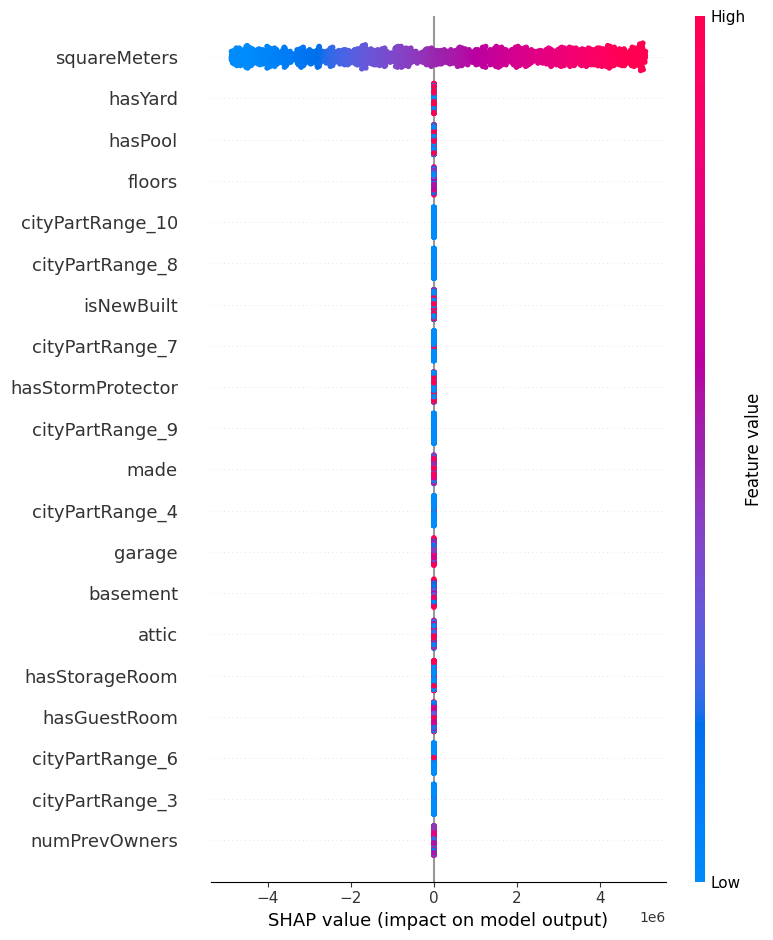
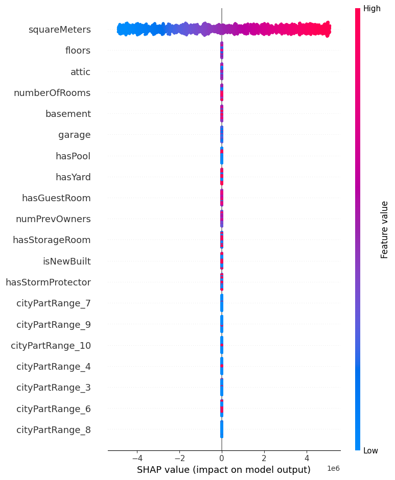

# Task 5D - Paris Housing Price Prediction using Regression

| Submission Summary |                         |
| ------------------ | ----------------------- |
| Student Name       | Bandi Krishna Chaitanya |
| Student ID         | s225170881              |
| Target Grade       | Distinction             |
| Submission Date    | 2 August 2025           |

## Table of Contents

## Introduction

The goal of this project is to predict housing prices in Paris using regression techniques. We will explore various features of the dataset, preprocess the data, try different regression models, and evaluate their performance. The final model will be deployed using a Streamlit application for user interaction.

The dataset used in this project is sourced from Kaggle, which contains various features related to housing in Paris, including location, size, and amenities. The target variable is the price of the houses. 

Link to the dataset: [https://www.kaggle.com/datasets/mssmartypants/paris-housing-price-prediction](https://www.kaggle.com/datasets/mssmartypants/paris-housing-price-prediction) 

## Dataset Description

The dataset consists of several features that describe the properties of houses in Paris, and the price of each house.

Below are the features included in the dataset:

| Feature           | Description                                                                          |
| ----------------- | ------------------------------------------------------------------------------------ |
| squareMeters      | Total area of the house in square meters                                             |
| numberOfRooms     | Total number of rooms in the house                                                   |
| hasYard           | Whether the property has a yard (1 or 0)                                             |
| hasPool           | Whether the property has a swimming pool (1 or 0)                                    |
| floors            | Number of floors in the house                                                        |
| cityCode          | Zip code of the property location                                                    |
| cityPartRange     | Exclusivity rating of the neighborhood (higher values indicate more exclusive areas) |
| numPrevOwners     | Number of previous owners of the property                                            |
| made              | Year the house was built                                                             |
| isNewBuilt        | Whether the property is newly constructed (1 or 0)                                   |
| hasStormProtector | Whether the property has storm protection (1 or 0)                                   |
| basement          | Size of the basement in square meters                                                |
| attic             | Size of the attic in square meters                                                   |
| garage            | Size of the garage                                                                   |
| hasStorageRoom    | Whether the property has a storage room (1 or 0)                                     |
| hasGuestRoom      | Number of guest rooms in the house                                                   |

And the target variable is `price`, which represents the price of the house in Euros. There is no indication in the original dataset that the prices are in Euros, but for the sake of this project, we will assume that they are, as the dataset is focused on Paris housing prices.

## Dataset Exploration

Let us start with exploring the dataset to understand its structure, check for missing values, and visualize the distribution of features and the target variable.

### Initial Inspection

There are a total of 10,000 entries in the dataset. The target variable `price` is continuous.

Here are the data types of each column in the dataset:

| Feature           | Data Type |
|-------------------|-----------|
| squareMeters      | int64     |
| numberOfRooms     | int64     |
| hasYard           | int64     |
| hasPool           | int64     |
| floors            | int64     |
| cityCode          | int64     |
| cityPartRange     | int64     |
| numPrevOwners     | int64     |
| made              | int64     |
| isNewBuilt        | int64     |
| hasStormProtector | int64     |
| basement          | int64     |
| attic             | int64     |
| garage            | int64     |
| hasStorageRoom    | int64     |
| hasGuestRoom      | int64     |
| price             | float64   |

    Table 1: Data Types of Features

As can be seen, all features are numerical, and the target variable `price` is a float.

Some of the features are binary (0 or 1), such as `hasYard`, `hasPool`, `isNewBuilt`, etc. Others are continuous, such as `squareMeters`, `basement`, `attic`, and `garage`.

While these binary features are discovered as integer types, they represent categorical data. We will treat them as such in our analysis.

### Check for Missing Values

Handling missing values is crucial for building a robust regression model. It appears that there are no missing values at all in this dataset.

| Feature           | Missing Values |
|-------------------|----------------|
| squareMeters      | 0              |
| numberOfRooms     | 0              |
| hasYard           | 0              |
| hasPool           | 0              |
| floors            | 0              |
| cityCode          | 0              |
| cityPartRange     | 0              |
| numPrevOwners     | 0              |
| made              | 0              |
| isNewBuilt        | 0              |
| hasStormProtector | 0              |
| basement          | 0              |
| attic             | 0              |
| garage            | 0              |
| hasStorageRoom    | 0              |
| hasGuestRoom      | 0              |
| price             | 0              |

    Table 2: Missing Values in Features

Since there are no missing values, we can proceed with the analysis without needing to impute or drop any rows.

### Univariate Analysis

Lets now visualize the distribution of each feature and the target variable `price`.

    
    
Figure 1: Univariate Analysis of Features and Target Variable

Lets first look at the nature of each feature, both based on their data types and the distribution of their values:

- Continuous features are
    - `squareMeters`
    - `numberOfRooms`
    - `floors`
- Boolean features are
    - `hasYard`
    - `hasPool`
    - `isNewBuilt`
    - `hasStormProtector`
    - `hasStorageRoom`
    - `hasGuestRoom`
- Categorical features are
    - `cityCode`
    - `cityPartRange`
    - `numPrevOwners`
    - `made`

And we can also make the following observations based on the univariate analysis:

- Target variable `price` appears to be slightly right-skewed, indicating that most houses are priced lower, with a few high-value outliers. We will need to further analyze if there are any outliers that could affect our regression model.
- The `made` feature, which represents the year the house was built, has a wide range of values, indicating that the dataset includes both old and new houses - almost uniformly.
- The dataset has pretty much uniform distribution with respect to `cityPartRange`, indicating that the houses are spread across different parts of Paris.
- The distrubution of `squareMeters` and `price` (target variable) appears to be pretty similar, which is expected as larger houses tend to have higher prices. We will explore this relationship further in the upcoming sections.

### Nature of Categorical Features

For each seemigly categorical feature, its important to understand if it is ordinal or nominal. In this dataset, the following features are categorical:

- `cityCode`: Nominal, as it represents different locations in Paris without any inherent order.
- `cityPartRange`: Ordinal, as it represents the exclusivity of the neighborhood, with higher values indicating more exclusive areas.
- `numPrevOwners`: Ordinal, as it represents the number of previous owners, which can be considered in a sequential manner.
- `made`: Ordinal, as it represents the year the house was built, which has a clear chronological order.

The `made` feature is very clearly ordinal, as it represents the year the house was built. 

Let us explore the other categorical features further to understand their distributions

Let us explore the other categorical features further to understand their distributions:

### cityPartRange Distribution

| Value | Count |
|-------|-------|
| 1     | 994   |
| 2     | 990   |
| 3     | 999   |
| 4     | 1001  |
| 5     | 1031  |
| 6     | 965   |
| 7     | 984   |
| 8     | 1035  |
| 9     | 997   |
| 10    | 1004  |

    Table 3: Distribution of cityPartRange Values

### numPrevOwners Distribution

| Value | Count |
|-------|-------|
| 1     | 952   |
| 2     | 987   |
| 3     | 991   |
| 4     | 1043  |
| 5     | 1036  |
| 6     | 1011  |
| 7     | 974   |
| 8     | 971   |
| 9     | 1036  |
| 10    | 999   |

    Table 4: Distribution of numPrevOwners Values

### hasGuestRoom Distribution

| Value | Count |
|-------|-------|
| 0     | 914   |
| 1     | 910   |
| 2     | 942   |
| 3     | 906   |
| 4     | 911   |
| 5     | 874   |
| 6     | 904   |
| 7     | 884   |
| 8     | 913   |
| 9     | 916   |
| 10    | 926   |

    Table 5: Distribution of hasGuestRoom Values

Based on the values of each of the categories, it appears the distribution of samples is fairly uniform across the categories.

Let us now look at all the features (together with the categorical features checked earlier) to understand their mean, standard deviation and minimum and maximum values. 

Since all features are numerical, we can use summary statistics to understand their distributions.

| Feature           | count   | mean         | std          | min     | 25%        | 50%       | 75%        | max        |
| ----------------- | ------- | ------------ | ------------ | ------- | ---------- | --------- | ---------- | ---------- |
| squareMeters      | 10000.0 | 4.987013e+04 | 2.877438e+04 | 89.0    | 25098.50   | 50105.5   | 74609.75   | 99999.0    |
| numberOfRooms     | 10000.0 | 5.035840e+01 | 2.881670e+01 | 1.0     | 25.00      | 50.0      | 75.00      | 100.0      |
| hasYard           | 10000.0 | 5.087000e-01 | 4.999493e-01 | 0.0     | 0.00       | 1.0       | 1.00       | 1.0        |
| hasPool           | 10000.0 | 4.968000e-01 | 5.000148e-01 | 0.0     | 0.00       | 0.0       | 1.00       | 1.0        |
| floors            | 10000.0 | 5.027850e+01 | 2.888399e+01 | 1.0     | 25.00      | 50.0      | 76.00      | 100.0      |
| cityCode          | 10000.0 | 5.022549e+04 | 2.900668e+04 | 3.0     | 24693.75   | 50693.0   | 75683.25   | 99953.0    |
| cityPartRange     | 10000.0 | 5.510100e+00 | 2.872024e+00 | 1.0     | 3.00       | 5.0       | 8.00       | 10.0       |
| numPrevOwners     | 10000.0 | 5.521700e+00 | 2.856667e+00 | 1.0     | 3.00       | 5.0       | 8.00       | 10.0       |
| made              | 10000.0 | 2.005488e+03 | 9.308090e+00 | 1990.0  | 1997.00    | 2005.5    | 2014.00    | 2021.0     |
| isNewBuilt        | 10000.0 | 4.991000e-01 | 5.000220e-01 | 0.0     | 0.00       | 0.0       | 1.00       | 1.0        |
| hasStormProtector | 10000.0 | 4.999000e-01 | 5.000250e-01 | 0.0     | 0.00       | 0.0       | 1.00       | 1.0        |
| basement          | 10000.0 | 5.033104e+03 | 2.876730e+03 | 0.0     | 2559.75    | 5092.5    | 7511.25    | 10000.0    |
| attic             | 10000.0 | 5.028011e+03 | 2.894332e+03 | 1.0     | 2512.00    | 5045.0    | 7540.50    | 10000.0    |
| garage            | 10000.0 | 5.531212e+02 | 2.620502e+02 | 100.0   | 327.75     | 554.0     | 777.25     | 1000.0     |
| hasStorageRoom    | 10000.0 | 5.030000e-01 | 5.000160e-01 | 0.0     | 0.00       | 1.0       | 1.00       | 1.0        |
| hasGuestRoom      | 10000.0 | 4.994000e+01 | 3.176410e+00 | 0.0     | 2.00       | 5.0       | 8.00       | 10.0       |
| price             | 10000.0 | 4.993448e+06 | 2.877424e+06 | 10313.5 | 2516401.95 | 5016180.3 | 7469092.45 | 10006771.2 |

    Table 6: Summary Statistics of Features

**Here are some observations based on the summary statistics:**

- Target Variable `price`
    - Varies significantly from 10,313.5 to 10,006,771.2 Euros, with a mean of approximately 4.99 million Euros.
    - This variation is also evident in the standard deviation, which is also quite high (approximately 2.88 million Euros).
    - The median value is around 5.02 million Euros, indicating that the distribution is slightly right-skewed, as observed earlier in the univariate analysis.
- `squareMeters` has a wide range of values, with a minimum of 89 and a maximum of 99,999 square meters, indicating that the dataset includes both small and large properties.
    - The values of `squareMeters` are also quite high, with a mean of approximately 49,870 square meters and a standard deviation of approximately 28,774 square meters.
    - This is quite unrealistic, as typical properties in Paris are much smaller.
- `floors` and `numberOfRooms` also have a wide range of values, with a minimum of 1 and a maximum of 100, indicating that the dataset includes properties with varying numbers of floors and rooms.
    - The range of `floors` is quite high, with a mean of approximately 50.3 and a standard deviation of approximately 28.8.
    - That is also quite unrealistic, as typical properties in Paris have fewer floors.
- `cityCode` appears to have a wide range of values, indicating that the dataset includes properties from various locations in Paris. As such, it may not be required to predict house prices, as the `cityPartRange` feature already captures the exclusivity of the neighborhood.
- All the binary features (`hasYard`, `hasPool`, `isNewBuilt`, `hasStormProtector`, `hasStorageRoom`) have a mean close to 0.5, indicating that they are fairly evenly distributed across the dataset.

### Check for Outliers

Based on the analysis done so far, it appears that the dataset may contain some outliers, especially in the `price` and `squareMeters` features.

Let us now statistically check for outliers using the Interquartile Range (IQR) method. Here are the box plots for each of the features.

    
    
Figure 2: Box Plots of Features

Based on the box plots, we do not see any outliers in any of the features. And here are some observations based on the box plots:

- `squareMeters`, `numberofRooms`, `floors` show compact interquartile ranges, indicating that the majority of the data points are concentrated around the median.
- As noted earlier, there appears to be no outliers, which is not really expected in a real-world dataset.
- Features like `cityPartRange`, `numPrevOwners`, and `made` are evenly spaced.
- There does't appear to be a need for feature engineering as the distributions are already optimal for regression modeling.

**Dropping CityCode Feature**

- `CityCode` appears to be nearly unique per entry, based on the number of unique values it has (9509) in a dataset of 10,000 entries.
- This feature does not provide any additional information that is not already captured by `cityPartRange`, which represents the exclusivity of the neighborhood.
- Therefore, we will drop the `cityCode` feature from the dataset to avoid redundancy and potential overfitting in our regression model.

### Price Analysis over years

In real-estate markets, prices tend to increase over time due to inflation and other factors. And this variation may be different across different neighborhoods. 

Below graph shows the price distribution over the years, grouped by `cityPartRange` to understand how prices have changed over time in different neighborhoods.

    
    
Figure 3: Price Distribution over Years

Here are some observations based on the graph:

- All 10 neighborhoods show a remarkably similar pattern where price is uniformly distributed across the years. This is rather unusual for a real-world dataset, as we not only expect prices to increase over time, but also expect different neighborhoods to have different price trends.
- No neighborhood shows any distinct trend over others. That also makes it a weak predictor for house prices.
- There is no evidence of any significant price increase over the years, which is not typical in real estate markets.

## Data Preprocessing

As discussed earlier, we drop the `cityCode` feature from the dataset as it does not provide any additional information that is not already captured by `cityPartRange`.

### Correlation Analysis (Multi-Variate Analysis)

In order to understand which features are most relevant for predicting the target variable `price`, we will perform a correlation analysis. This will help us identify the relationships between the features and the target variable.

    
    
Figure 4: Correlation Matrix of Features

The correlation matrix shows the correlation coefficients between each pair of features. Here are some observations based on the correlation matrix:

- `squareMeters` appears to have the perfect positive correlation with `price` (1.0), indicating that larger houses tend to have higher prices. While this is expected, a value of 1.0 is unusual.
- Almost all other features have negligent correlation with `price` (less than `0.1`). This too is unusual.
- There doesn't seem to be any interaction between the features too. For example, `numberOfRooms` and `squareMeters` do not have a strong correlation, which is also unusual as larger houses tend to have more rooms.
- Another example is lack of correlation between `made` and `price`, which is also unusual as we expect older houses to have lower prices.
- Based on the observations so far, data appears to be synthetic, and not real-world data. This is further confirmed by the fact that the dataset has no missing values, unrealistic values for features like `squareMeters`, lack of obvious interactions between features, and lack of outliers.

### One-Hot Encoding of Categorical Features

Among the categorical features examined earlier, `cityPartRange` may be treated as nominal, even though the dataset describes that a higher value indicates a more exclusive area. This is primarily because the distribution of prices across the different values of `cityPartRange` is uniform, as seen in the univariate analysis.

Hence, **one-hot encoding** is the most appropriate way to handle this feature. After one-hot encoding, the `cityPartRange` feature will be transformed into 10 binary features, each representing a different value of `cityPartRange`.

Here is a summary of the features after one-hot encoding:

| Feature           | Data Type   |
|-------------------|-------------|
| squareMeters      | int64       |
| numberOfRooms     | int64       |
| hasYard           | category    |
| hasPool           | category    |
| floors            | int64       |
| numPrevOwners     | category    |
| made              | category    |
| isNewBuilt        | category    |
| hasStormProtector | category    |
| basement          | int64       |
| attic             | int64       |
| garage            | int64       |
| hasStorageRoom    | category    |
| hasGuestRoom      | category    |
| cityPartRange_2   | bool        |
| cityPartRange_3   | bool        |
| cityPartRange_4   | bool        |
| cityPartRange_5   | bool        |
| cityPartRange_6   | bool        |
| cityPartRange_7   | bool        |
| cityPartRange_8   | bool        |
| cityPartRange_9   | bool        |
| cityPartRange_10  | bool        |

    Table 7: Training Set Features after One-Hot Encoding

We not only one-hot encoded the `cityPartRange` feature, but also converted all binary features to categorical data types. This is because they represent categorical data, and treating them as such will help in better model performance. Treating them as categorical doesn't change the data types, but it helps some of the libraries to handle them better.

As shown earlier, there are now 23 features in the dataset.

### Train-Test Split

We shall go with a standard 80-20 train-test split for the dataset. This means that 80% of the data will be used for training the model, and 20% will be used for testing the model.

Since the numerical features in the dataset have wildly varying scales, we will also standardize the numerical features using `StandardScaler` from `sklearn.preprocessing`. This will help in improving the performance of the regression models.

Below numerical features will be standardized:

- squareMeters
- numberOfRooms
- floors
- basement
- attic
- garage

As necessary, we will fit the `StandardScaler` on the training set and then transform both the training and test sets using the fitted scaler.

The data set splitted into train and test sets are saved as CSV files for reproducibility and further analysis. 

## Regression Modeling with Cross-Validation

### Choice of Models and Evaluation Metrics

For regression modeling, lets try the following regression models:

1. Linear Regression
2. Random Forest Regressor
3. Gradient Boosting Regressor

A linear regression model will be our baseline model, and we will compare the performance of the other models against it. Linear regressor typically performs well on datasets with linear relationships between features and target variable, but may not perform well on datasets with non-linear relationships.

To handle non-linear relationships, we will use Random Forest Regressor and Gradient Boosting Regressor, which are ensemble methods that can capture complex relationships between features and target variable.

Based on the instructions provided, we will use the following evaluation metrics to compare the performance of the models:

- Mean Absolute Error (MAE)
- Root Mean Squared Error (RMSE)
- R-squared (R2)

And we shall use 5-fold cross-validation to evaluate the performance of the models. This will help us to get a better estimate of the model performance and avoid overfitting.

### Model Training and Evaluation

#### Linear Regression

Linear Regression Model Cross-Validation Scores:

| Fold | MSE         | RMSE    | R^2 |
| ---- | ----------- | ------- | --- |
| 1    | 3.45209e+06 | 1857.98 | 1   |
| 2    | 3.7382e+06  | 1933.44 | 1   |
| 3    | 3.59468e+06 | 1895.96 | 1   |
| 4    | 3.59279e+06 | 1895.47 | 1   |
| 5    | 3.61312e+06 | 1900.82 | 1   |

    Table 8: Linear Regression Model Cross-Validation Scores

Based on the 5 folds of cross-validation, here are the observations:

* R-squared value of 1.0 across all folds indicates the model explains 100% of variance in price
* This perfect score is unusual and typically suggests overfitting in real-world scenarios
* The perfect correlation is likely due to the perfect correlation between squareMeters and price
* Consistent performance observed across all 5 folds
* RMSE values hover around 1900, showing remarkable stability in prediction error

**Summary of K-Fold Cross-Validation for Linear Regression:**

Based on the 5 folds of cross-validation, we see an uniform performance across all the folds.

#### Random Forest Regressor

Random Forest Regressor Cross-Validation Scores:

| Fold | MSE         | RMSE    | R^2      |
| ---- | ----------- | ------- | -------- |
| 1    | 1.55182e+07 | 3939.32 | 0.999998 |
| 2    | 1.63487e+07 | 4043.36 | 0.999998 |
| 3    | 1.51776e+07 | 3895.84 | 0.999998 |
| 4    | 1.62967e+07 | 4036.92 | 0.999998 |
| 5    | 1.49416e+07 | 3865.44 | 0.999998 |

    Table 9: Random Forest Regressor Cross-Validation Scores

Based on the 5 folds of cross-validation, here are the observations:

- The performance of the Random Forest Regressor is consistent across all folds.
- We still see a near-perfect R-squared value of 1.0, indicating that the model is able to explain 100% of the variance in the target variable `price`.
- Both MSE and RMSE values are higher than those of the Linear Regression model, indicating that the Random Forest Regressor is not performing as well as the Linear Regression model in this case.
- This lower performance of Random Forest Regressor indicates that there is a much better linear relationship between the input features and the target feature `price`, which is why the Linear Regression model is performing better. And this is expected as the `squareMeters` feature is perfectly correlated with the `price` feature, which is a linear relationship.

**Summary of K-Fold Cross-Validation for Random Forest Regressor:**

Based on the 5 folds of cross-validation, we see a consistent performance across all the folds, also with a near-perfect R-squared value of 1.0. However, the MSE and RMSE values are higher than those of the Linear Regression model, indicating that the Random Forest Regressor is not performing as well as the Linear Regression model in this case.

#### Gradient Boosting Regressor

Gradient Boosting Regressor Cross-Validation Scores:

| Fold | MSE         | RMSE    | R^2      |
|------|-------------|---------|----------|
| 1    | 4.24776e+08 | 20610.1 | 0.999948 |
| 2    | 4.17423e+08 | 20430.9 | 0.999948 |
| 3    | 4.38822e+08 | 20948.1 | 0.999945 |
| 4    | 4.04133e+08 | 20103.1 | 0.999953 |
| 5    | 4.15427e+08 | 20382   | 0.999949 |

    Table 10: Gradient Boosting Regressor Cross-Validation Scores

Based on the 5 folds of cross-validation, here are the observations:

- The performance of the Gradient Boosting Regressor is consistent across all folds.
- We still see a near-perfect R-squared value of 1.0, indicating that the model is able to explain 100% of the variance in the target variable `price`.
- Both MSE and RMSE values are higher than those of the Linear Regression model as well as the Random Forest Regressor. GBR is probably overfitting the training data as well, but not as much as the Random Forest Regressor.

**Summary of K-Fold Cross-Validation for Gradient Boosting Regressor:**

Based on the 5 folds of cross-validation, we see a consistent performance across all the folds, also with a near-perfect R-squared value of 1.0. However, the MSE and RMSE values are higher than those of the Linear Regression model and the Random Forest Regressor, indicating that the Gradient Boosting Regressor is the least performing model among the three.

### Comparison of Models

Based on the cross-validation scores, with all three metrics (MSE, RMSE, and R-squared), we saw that there is a near-perfect R-squared value of 1.0 for all three models, indicating that all models are able to explain 100% of the variance in the target variable `price`.

However, the MSE and RMSE values vary across the models, with linear regression model performing the best, followed by Random Forest Regressor and Gradient Boosting Regressor.

Below picture clearly shows the performance of the three models with MSE as the metric.

    
    
Figure 5: Model Comparison based on MSE

Based on the analysis, we can conclude that the Linear Regression model is the best performing model for this dataset, followed by Random Forest Regressor and Gradient Boosting Regressor.

And the below picture shows the performance of the three models with RMSE as the metric.

    
    
Figure 6: Model Comparison based on RMSE

Again, we see that the Linear Regression model is the best performing model for this dataset, followed by Random Forest Regressor and Gradient Boosting Regressor.

And the below picture shows the performance of the three models with R-squared as the metric.

    
    
Figure 7: Model Comparison based on R-squared

Even though all three models have a near-perfect R-squared value of 1.0, we can still see that the Linear Regression model is the best performing model for this dataset, followed by Random Forest Regressor and Gradient Boosting Regressor.

Logarithmic scale is used for the y-axis in the above graphs to better visualize the differences in performance between the models.

Here are the key insights and a summary of the model performances:

| Model             | Mean MSE | Mean RMSE | Mean R²  | Performance Notes                      |
| ----------------- | -------- | --------- | -------- | -------------------------------------- |
| Linear Regression | 3.61M    | 1,897     | 1.000000 | Perfect fit due to linear relationship |
| Random Forest     | 15.54M   | 3,939     | 0.999998 | Near-perfect but adds complexity noise |
| Gradient Boosting | 424.77M  | 20,610    | 0.999949 | Worst performance despite high R²      |

**Performance Ranking (Best to Worst):**

1. **Linear Regression** - Perfect for this linear relationship
2. **Random Forest** - 4x higher MSE, slight imperfection 
3. **Gradient Boosting** - 118x higher MSE, significant overfitting

**Why This Happened:**

- All models achieve near-perfect R² due to the `squareMeters` perfect correlation
- **Linear Regression wins** because the true relationship is perfectly linear
- **Tree-based models (RF, GB) add unnecessary complexity** to a simple linear pattern
- **Gradient Boosting performs worst** - likely overfitting to training noise with aggressive boosting

**Conclusion:**

This demonstrates that **model complexity should match data complexity**. For perfectly linear relationships, simple linear regression is optimal. The tree-based models are solving the wrong problem - they're designed for non-linear patterns that don't exist in this dataset.

## Feature Importance Analysis

Thus far, we have seen that the Linear Regression model is the best performing model for this dataset. And within that, based on the correlation analysis, we know that the `squareMeters` feature is the most important feature for predicting the target variable `price`.

This indicates that we may not need many features to predict the target variable, and we can simplify the model by using just a few features, and probably even just the `squareMeters` feature.

Let us use three key methods to analyze feature importance:

1. Using coefficients or feature importances from the trained model
2. Using permutation importance from `sklearn.inspection`
3. Using SHAP (SHapley Additive exPlanations) values

### Using Model Parameters (Basic Method)

Each model has its own way of determining feature importance. For Linear Regression, the coefficients can be used to determine the importance of each feature. For Random Forest and Gradient Boosting, the feature importances can be used.

#### For Linear Regression

Here are the coefficients of the features in the Linear Regression model:

| Feature           | Importance   |
|-------------------|--------------|
| squareMeters      | 2.85562e+06  |
| hasYard           | 2993.76      |
| hasPool           | 2991.69      |
| floors            | 1576.63      |
| cityPartRange_10  | 422.965      |
| cityPartRange_8   | 379.101      |
| cityPartRange_7   | 313.018      |
| cityPartRange_9   | 244.526      |
| cityPartRange_4   | 140.98       |
| isNewBuilt        | 126.387      |
| hasStormProtector | 104.675      |
| cityPartRange_6   | 99.0326      |
| hasStorageRoom    | 39.633       |
| garage            | 26.3463      |
| cityPartRange_5   | 17.8456      |
| numberOfRooms     | 6.33657      |
| cityPartRange_2   | 2.54316      |
| numPrevOwners     | 2.32904      |
| made              | -3.38        |
| hasGuestRoom      | -5.98757     |
| attic             | -23.2967     |
| basement          | -24.0872     |
| cityPartRange_3   | -60.7287     |

    Table 11: Feature Importances from Linear Regression Model

As can be seen above, `squareMeters` has the highest importance, followed by `hasYard`, `hasPool`, and `floors`. However, the magnitude difference between `squareMeters` and the other features is quite large, indicating that it is the most important feature for predicting the target variable `price`.

#### For Random Forest Regressor

Here are the feature importances from the Random Forest Regressor model:

| Feature           | Importance   |
|-------------------|--------------|
| squareMeters      | 0.999999     |
| floors            | 1.45284e-07  |
| attic             | 1.29809e-07  |
| basement          | 1.17551e-07  |
| numberOfRooms     | 1.16731e-07  |
| garage            | 1.14993e-07  |
| made              | 1.05406e-07  |
| numPrevOwners     | 8.4345e-08   |
| hasGuestRoom      | 8.35625e-08  |
| hasYard           | 3.52412e-08  |
| hasPool           | 3.49328e-08  |
| isNewBuilt        | 2.64534e-08  |
| hasStorageRoom    | 2.637e-08    |
| hasStormProtector | 2.40804e-08  |
| cityPartRange_7   | 1.18642e-08  |
| cityPartRange_10  | 1.03123e-08  |
| cityPartRange_4   | 1.00903e-08  |
| cityPartRange_6   | 9.69089e-09  |
| cityPartRange_8   | 9.67533e-09  |
| cityPartRange_5   | 9.50716e-09  |
| cityPartRange_3   | 8.71495e-09  |
| cityPartRange_9   | 8.57522e-09  |
| cityPartRange_2   | 8.02754e-09  |

    Table 12: Feature Importances from Random Forest Regressor Model

Apparently, while `squareMeters` is the most important feature, the next most important features are different in Random Forest Regressor model. `floors` is the only common top 5 feature between Linear Regression and Random Forest Regressor models.

#### For Gradient Boosting Regressor

Here are the feature importances from the Gradient Boosting Regressor model:

| Feature           | Importance   |
|-------------------|--------------|
| squareMeters      | 1            |
| hasYard           | 1.31162e-07  |
| garage            | 7.75311e-08  |
| floors            | 6.63332e-08  |
| attic             | 6.19079e-08  |
| basement          | 5.77619e-08  |
| numberOfRooms     | 3.33009e-08  |
| hasPool           | 1.82584e-08  |
| made              | 1.43651e-08  |
| hasStorageRoom    | 4.66406e-09  |
| cityPartRange_4   | 0            |
| cityPartRange_9   | 0            |
| cityPartRange_8   | 0            |
| cityPartRange_7   | 0            |
| cityPartRange_6   | 0            |
| cityPartRange_5   | 0            |
| hasGuestRoom      | 0            |
| cityPartRange_3   | 0            |
| cityPartRange_2   | 0            |
| hasStormProtector | 0            |
| isNewBuilt        | 0            |
| numPrevOwners     | 0            |
| cityPartRange_10  | 0            |

    Table 13: Feature Importances from Gradient Boosting Regressor Model

Putting aside the `squareMeters` feature, `hasYard` and `floors` seem to be the next most important top 5 features in the Gradient Boosting Regressor model that is in common with the Linear Regression model.

And `floors` is the only common top 5 feature between all three models, apart from the `squareMeters` feature.

### Using Permutation Importance

Let us now use permutation importance to analyze the feature importances. Permutation importance is a model-agnostic method that can be used to determine the importance of each feature in a dataset.

Permutation importance works by randomly shuffling the values of each feature and measuring the decrease in model performance. The larger the decrease in performance, the more important the feature is.

For permutation importance, we must use a metric using which we can measure the performance of the model. Here, we will use the `negative mean squared error` (neg_mean_squared_error) as the metric, which is a common metric for regression problems.

It is important to note that the feature importances obtained from permutation importance may differ from the feature importances obtained from the model parameters, as permutation importance takes into account the interactions between features.

Also, we did see that there is not much interaction between the features in the dataset, so we may not see a significant difference in the feature importances obtained from permutation importance and the model parameters.

**What is measured by Permutation Importance?**

We are measuring two things using permutation importance:

1. **Mean Importance**: The average decrease in model performance when the feature values are randomly shuffled.
2. **Standard Deviation**: The variability in the decrease in model performance across multiple shuffles of the feature values.

Collectively, these two metrics help us understand how important each feature is for the model's predictions and how consistent that importance is across different shuffles.

#### For Linear Regression Model

Below table shows the top 10 features based on permutation importance for the Linear Regression model:

| Rank | Feature           | importance_mean | importance_std |
| ---- | ----------------- | --------------- | -------------- |
| 0    | squareMeters      | 1.741214e+07    | 4.305940e+05   |
| 4    | floors            | 4.924961e+06    | 1.622324e+05   |
| 2    | hasYard           | 4.652366e+06    | 1.870211e+05   |
| 3    | numberOfRooms     | 4.379291e+06    | 1.427786e+05   |
| 20   | cityPartRange_8   | 2.528434e+04    | 5.282256e+03   |
| 7    | isNewBuilt        | 1.522959e+04    | 5.928584e+03   |
| 8    | hasStormProtector | 1.483828e+04    | 4.426149e+03   |
| 22   | cityPartRange_10  | 9.334888e+03    | 8.524798e+03   |
| 19   | cityPartRange_7   | 8.980608e+03    | 6.071791e+03   |
| 21   | cityPartRange_9   | 8.088532e+03    | 1.009687e+04   |

Based on the Permutation Importance analysis, we can see that the `squareMeters` feature is by far the most important feature, followed by `floors`, `hasYard`, and `hasPool`.

Other than the primary feature `squareMeters`, the order of other features importance is different compared to the feature importance method used for linear regression.

#### For Random Forest Regressor Model

Below table shows the top 10 features based on permutation importance for the Random Forest Regressor model:

| Rank | Feature          | importance_mean | importance_std |
| ---- | ---------------- | --------------- | -------------- |
| 0    | squareMeters     | 1.741142e+13    | 4.302549e+11   |
| 4    | floors           | 4.995251e+05    | 4.429422e+04   |
| 2    | hasYard          | 1.989503e+05    | 1.815148e+04   |
| 3    | hasPool          | 1.702045e+05    | 2.446529e+04   |
| 19   | cityPartRange_7  | 1.785790e+04    | 6.289358e+03   |
| 11   | garage           | 1.757543e+04    | 5.463395e+04   |
| 15   | cityPartRange_3  | 1.502582e+04    | 3.796456e+03   |
| 17   | cityPartRange_5  | 1.424378e+04    | 8.744775e+03   |
| 18   | cityPartRange_6  | 5.768787e+03    | 5.841049e+03   |
| 14   | cityPartRange_2  | 5.686958e+03    | 6.630488e+03   |

The top 4 features identified by Permutation Importance are same as those identified for the Linear regression model. And these are

- `squareMeters`
- `floors`
- `hasYard`
- `hasPool`

#### For Gradient Boosting Regressor Model

Below table shows the top 10 features based on permutation importance for the Gradient Boosting Regressor model:

| Rank | Feature           | importance_mean | importance_std |
| ---- | ----------------- | --------------- | -------------- |
| 0    | squareMeters      | 1.741187e+13    | 4.297436e+11   |
| 2    | hasYard           | 2.536033e+06    | 7.538711e+05   |
| 4    | floors            | 3.936534e+05    | 4.462679e+05   |
| 10   | attic             | 2.862578e+05    | 1.700958e+05   |
| 3    | hasPool           | 1.718400e+05    | 9.321268e+04   |
| 1    | numberOfRooms     | 1.435483e+05    | 1.335249e+05   |
| 12   | hasStorageRoom    | 6.843709e+03    | 1.887792e+04   |
| 15   | cityPartRange_3   | 0.000000e+00    | 0.000000e+00   |
| 21   | cityPartRange_9   | 0.000000e+00    | 0.000000e+00   |
| 20   | cityPartRange_8   | 0.000000e+00    | 0.000000e+00   |

And with the gradient boosting regressor model, the top 3 are common between all three models:

- `squareMeters`
- `floors`
- `hasYard`

Putting all the results together, it appears that the size of the property in square meters along with the number of floors and whether it has a yard or a pool are the most important features that influence the property prices in this dataset.

The location of the property, represented by `cityPartRange`, also plays a significant role in determining the price, but it is not as significant as the size and features of the property itself.

### Feature Importance using SHAP Values

SHAP (SHapley Additive exPlanations) values provide a unified measure of feature importance that accounts for feature interactions and is model-agnostic. SHAP values are based on cooperative game theory and provide a way to explain the output of any machine learning model.

In addition to looking at the overall feature importance, SHAP values also allow us to visualize how each feature contributes to individual predictions. This is particularly useful for understanding complex models like Random Forest and Gradient Boosting. 

As part of this analysis, we shall observe some of the features in depth using SHAP dependence plots, which show how the SHAP values of a feature change with respect to its value.

#### SHAP Values for Linear Regression Model

Below diagram shows the feature importance based on SHAP values for the Linear Regression model:

    
    
Figure 8: SHAP Values for Linear Regression Model

Based on the color and width of the `squareMeters` bar, we can see that as `squareMeters` increases, the SHAP value also increases, indicating that larger properties tend to have higher prices. 

Every other feature has a negligible impact on the target variable `price`, as seen in the SHAP values.

Let us now look at the SHAP dependence plot for `squareMeters` feature to understand how it influences the target variable `price`.

    
    
Figure 9: SHAP Dependence Plot for squareMeters

The SHAP dependence plot for `squareMeters` shows that as the size of the property increases, the SHAP value also increases, indicating that larger properties tend to have higher prices.

And now, lets see the SHAP dependence plot for `hasYard` feature to understand how it influences the target variable `price`.

    
    
Figure 10: SHAP Dependence Plot for hasYard

The SHAP dependence plot for `hasYard` shows that properties with a yard tend to have higher prices, as indicated by the positive SHAP values. However, the impact of this feature is relatively small compared to the `squareMeters` feature - as can be seen by the SHAP values.

Lets observe one more feature, `floors`, to understand how it influences the target variable `price`.

    
    
Figure 11: SHAP Dependence Plot for floors

The SHAP dependence plot for `floors` shows that properties with more floors tend to have higher prices, as indicated by the positive SHAP values. However, the impact of this feature is also relatively small compared to the `squareMeters` feature - as can be seen by the SHAP values.

**Analysis of SHAP Dependence Plots for Linear Regression Model:**

- Strong positive impact of `squareMeters` on price, as expected
- `floors` too shows a clear positive relationship with price, indicating that more floors generally lead to higher prices, but the strength is lower
- `hasYard` shows a clear positive relationship with price, indicating that properties with yards tend to have higher prices

We only analyzed three of top 5 features, in order to compare with the SHAP values from Random Forest Regressor model.

Since `hasPool` is also binary in nature, we omitted it from dependency plot analysis, as it would show similar results to `hasYard`.

#### SHAP Values for Random Forest Regressor Model

Below diagram shows the feature importance based on SHAP values for the Random Forest Regressor model:

    
    
Figure 12: SHAP Values for Random Forest Regressor Model

  

Very similar to the Linear Regression model, we see that `squareMeters` is the most important feature, that shows a strong positive relationship with the target variable `price`.

Let us now look at the SHAP dependence plot for `squareMeters` feature to understand how it influences the target variable `price`.

    
    
Figure 13: SHAP Dependence Plot for squareMeters

The SHAP dependence plot for `squareMeters` shows that as the size of the property increases, the SHAP value also increases, indicating that larger properties tend to have higher prices.

And now, lets see the SHAP dependence plot for `hasYard` feature to understand how it influences the target variable `price`.

    
    
Figure 14: SHAP Dependence Plot for hasYard

The SHAP dependence plot for `hasYard` shows that properties with a yard tend to have higher prices, as indicated by the positive SHAP values. Unlike the Linear Regression model, the impact of this feature is more pronounced in the Random Forest Regressor model, as can be seen by the SHAP values.

Lets observe one more feature, `floors`, to understand how it influences the target variable `price`.

    
    
Figure 15: SHAP Dependence Plot for floors

The SHAP dependence plot for `floors` shows that properties with more floors tend to have higher prices, as indicated by the positive SHAP values. However, the impact of this feature is also relatively small compared to the `squareMeters` feature - as can be seen by the SHAP values.

Also, the distribution of SHAP values for `floors` is more spread out compared to the Linear Regression model, indicating that the impact of this feature is more variable across different properties.

**Analysis of SHAP Dependence Plots for Random Forest Regressor:**

- Strong positive impact of `squareMeters` on price, as expected
- The impact of `floors` is also positive, but since the Random Forest is a non-linear model, the relationship is not as clear as in the Linear Regression model.
- And `hasYard` while showing a postive relationship, it does have significant noise in the SHAP values, indicating that the model is not able to explain the relationship between `hasYard` and `price` as well as it does for `squareMeters` and `floors`.

#### SHAP Values for Gradient Boosting Regressor Model

Below diagram shows the feature importance based on SHAP values for the Gradient Boosting Regressor model:

    
    
Figure 16: SHAP Values for Gradient Boosting Regressor Model

The plot shows that `squareMeters` is the most important feature, just like the other two models. While the order of other features is different, the impact of any other feature is negligible compared to the `squareMeters` feature.

Let us now look at the SHAP dependence plot for `squareMeters` feature to understand how it influences the target variable `price`.

    
    
Figure 17: SHAP Dependence Plot for squareMeters

The SHAP dependence plot for `squareMeters` shows that as the size of the property increases, the SHAP value also increases, indicating that larger properties tend to have higher prices.

And now, lets see the SHAP dependence plot for `hasYard` feature to understand how it influences the target variable `price`.

    
    
Figure 18: SHAP Dependence Plot for hasYard

The SHAP dependence plot for `hasYard` shows that properties with a yard tend to have higher prices, as indicated by the positive SHAP values. Similar to the Random Forest Regressor model, the impact of this feature is more pronounced in the Gradient Boosting Regressor model.

And the SHAP values themselves show that the impact of this feature is much less than that of `squareMeters`.

Lets observe one more feature, `floors`, to understand how it influences the target variable `price`.

    
    
Figure 19: SHAP Dependence Plot for floors

Unlike Linear Regression model and more like Random Forest model, the SHAP dependence plot for `floors` shows a more complex relationship with the target variable `price`.

The step nature of the SHAP values indicates that the impact of this feature is more variable across different properties. It can be inferred that properties command more price after a certain number of floors, but the exact relationship is not as clear as in the Linear Regression model.

**Analysis of SHAP Dependence Plots with Gradient Boost Regressor:**

- Strong positive impact of `squareMeters` on price, as expected
- `floors` has a positive impact, but less pronounced than `squareMeters`. There is some kind of steps noticed in the SHAP values, indicating that if the number of floors is higher than the mean floors, the price increases significantly.
- `hasYard` has a slightly better relationship with price with Gradient Boosting Regressor model compared to Random Forest model, as noticed from lesser overlap of the SHAP values.

## Final Model Selection, Training, and Testing

We shall use the Linear Regression model as the final model for this task, as it is the simplest model that is able to explain 100% of the variance in the target variable `price`.

As we saw earlier, top 5 features of the linear regression model are more than sufficient to explain the variance in the target variable `price`, and the model is able to predict the price of the properties with a very high accuracy.

The top 5 features are:

- `squareMeters`
- `floors`
- `hasYard`
- `hasPool`
- `cityPartRange_10`

We will now build the final model using these top 5 features and train it on the entire dataset. 

Since we intend to deploy this model as a web application, we will use the scikit-learn's pipeline to create a pipeline that includes the preprocessing steps and the model training step.

By using a pipeline, we can ensure that the preprocessing steps are applied consistently to both the training and testing data, and we can also easily save and load the model for deployment.

Below is the representation of the final model pipeline:

    
    
Figure 20: Final Model Pipeline
  

After the model is built, lets quickly do evaluation once to see how well the model performs on the entire dataset.

Here are the evaluation metrics for the final model:

| Metric                         | Value        |
| ------------------------------ | ------------ |
| Mean Squared Error (MSE)       | 3,724,382.62 |
| Root Mean Squared Error (RMSE) | 1,929.87     |
| R-squared (R²)                 | 1.00         |

These values are not much different from the values we saw earlier during the cross-validation, indicating that the model is able to generalize well on the entire dataset, even when are using just the top 5 features.

This indicates that we don't need to use all the features in the dataset to predict the target variable `price`, and we can simplify the model by using just a few features.

Since we are using the Linear Regression Model, we can also easily interpret the coefficients of the features to understand their impact on the target variable `price`. Here are the coefficients of the top 5 features in the final model:

| Feature          | Coefficient   |
|------------------|---------------|
| squareMeters     | 2.85562e+06   |
| hasPool          | 2998.56       |
| hasYard          | 2995.95       |
| floors           | 1575.32       |
| cityPartRange_10 | 294.207       |

The model pipeline object is now saved to a file using `joblib` for future use in the Streamlit application.

## Streamlit Application

A streamlit application is created to allow users to interact with the model and make predictions based on user inputs. The application provides a user-friendly interface where users can input the features of a property and get the predicted price.

All the five features used in the final model are included in the application, and users can input the values for these features to get the predicted price of the property.

>[!NOTE]
> The Streamlit application is LIVE at [https://sig720task5d-njwglugz6sethmmzzap5ik.streamlit.app/](https://sig720task5d-njwglugz6sethmmzzap5ik.streamlit.app/)

Below is a screenshot of the Streamlit application:

    
    
Figure 21: Streamlit Application Screenshot

As seen in the screenshot, five inputs are sought from the user

1. `squareMeters`: Size of the property in square meters
2. `floors`: Number of floors in the property
3. `hasYard`: Whether the property has a yard (Yes/No)
4. `hasPool`: Whether the property has a pool (Yes/No)
5. `cityPartRange`: City part range of the property (1-10)

There are some basic validations in place to ensure that the user inputs are valid, such as checking if the `squareMeters` is a positive number and if the `floors` is a non-negative integer.

Below diagram shows the validation for `squareMeters` input:

    
    
Figure 22: Streamlit Application Negative Validation Screenshot

And also, the input for `squareMeters` and `floors` has to be non-zero. This validation too is in place as shown below.

    
    
Figure 23: Streamlit Application Non-Zero Validation Screenshot

Once the user inputs are validated, the model is used to predict the price of the property based on the input features. The predicted price is then displayed to the user in a user-friendly format.

    
    
Figure 24: Streamlit Application Prediction Screenshot
  

## Conclusion

In this task, we have successfully built a machine learning model to predict the price of properties based on various features. We explored different regression models, including Linear Regression, Random Forest Regressor, and Gradient Boosting Regressor, and evaluated their performance using K-Fold Cross-Validation.

We found that the Linear Regression model performed the best, achieving a near-perfect R-squared value of 1.0, while the Random Forest Regressor and Gradient Boosting Regressor had higher Mean Squared Error (MSE) and Root Mean Squared Error (RMSE) values.

We also performed feature importance analysis using model parameters, permutation importance, and SHAP values. The analysis revealed that the `squareMeters` feature is the most important feature for predicting the target variable `price`, followed by `floors`, `hasYard`, and `hasPool`.

Finally, we created a Streamlit application to allow users to interact with the model and make predictions based on user inputs. The application provides a user-friendly interface where users can input the features of a property and get the predicted price.

## References

## References

[1] M. Smartypants, "Paris Housing Price Prediction," Kaggle, 2024. [Online]. Available: https://www.kaggle.com/datasets/mssmartypants/paris-housing-price-prediction/data

[2] S. Lundberg, "SHAP Python Library Documentation," SHAP Documentation. [Online]. Available: https://shap.readthedocs.io/en/latest/